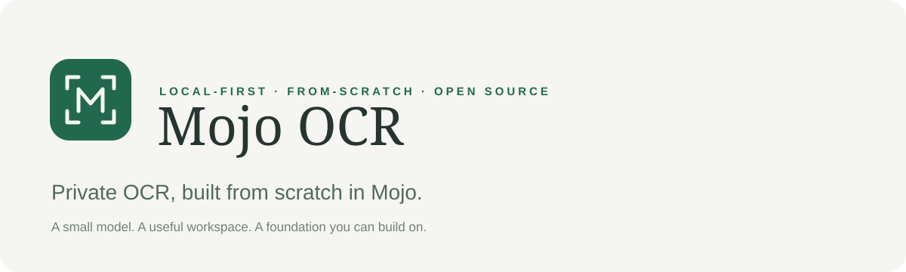

<p align="center"></p>

<p align="center">
  <a href="https://github.com/goose4500/mojo-ocr/actions/workflows/ci.yml"></a>
  <a href="LICENSE"></a>
  <a href="https://mojolang.org/"></a>
</p>

# Mojo OCR

**Private OCR, built from scratch in Mojo.** A local-first toolkit for turning printed text in screenshots, images, and PDFs into something you can edit, search, and keep.

The included **403 KiB neural model is trained from random weights**. Mojo implements the actual forward pass, loss, backpropagation, and optimizer—not a wrapper around pretrained OCR or a cloud API. Python handles document I/O, preprocessing, and the browser workspace.

> **Experimental printed-ASCII OCR, not production-grade document intelligence.** Best on clean screenshots and familiar fonts. No handwriting, Unicode, robust scene-text detection, or complex layout reconstruction. Review important text and numbers.

## Start here

Linux, Python **3.13**, [uv](https://docs.astral.sh/uv/), and [Mojo **1.0.0**](https://mojolang.org/install/) are the supported foundation. Windows users can use WSL2. The original local baseline was measured on ARM64; CI also exercises Linux x86-64.

```bash
git clone https://github.com/goose4500/mojo-ocr.git
cd mojo-ocr

# Install the compiler into an isolated project environment.
# Skip these two lines if you already have a compatible setup.
uv venv --python 3.13 .venv
uv pip install --python .venv/bin/python 'mojo==1.0.0'

./setup.sh
./ocr serve
```

Open **http://localhost:8878** and select **Try an example**, or drop in an image/PDF. No account, API key, or model download is required after cloning and installing dependencies.

For training and tests, install the local font packages on Ubuntu:

```bash
sudo apt-get install fonts-dejavu-core fonts-liberation fonts-freefont-ttf
```

The setup script compiles the native library for your CPU. It does not retrain the included checkpoint. macOS/native Windows are not currently supported by the project scripts.

## One model, several useful tools

| Tool | What you can do |
|---|---|
| **Browser workspace** | Drop/paste images, preview pages, edit text, inspect confidence boxes, export |
| **Image & PDF OCR** | Batch extraction to plain text and JSON with character coordinates |
| **Searchable PDFs** | Create new raster PDFs with an invisible OCR text layer |
| **Local search** | Index documents into a private SQLite FTS5 archive |
| **Personalization** | Train on your fonts or fine-tune from corrected glyphs |
| **Evaluation** | Measure your own labeled documents and reproduce the synthetic baseline |

```bash
./ocr read examples/note.png
./ocr read scan.pdf --out output/scans --pdf --review
./ocr index ~/Documents/scans --recursive --db output/archive.sqlite3
./ocr search 'invoice' --db output/archive.sqlite3
./ocr train --model models/personal.npz
```

See the **[usage guide](docs/USAGE.md)** for preprocessing, corrections, custom fonts, PDF behavior, and the Python API. Browser text edits affect text export only; they do not retrain the model or change the PDF/JSON.

## Honest baseline

| Measurement | Recorded result |
|---|---:|
| Model parameters | 110,558 |
| Compressed checkpoint | 412,231 bytes |
| Synthetic document character error rate | **2.96%** |
| Character error rate on unseen fonts | 6.21% |
| Median warm processing, 900×230 image | ~39 ms |

These are **development results on 84 renderings of four passages**, not 84 independent real documents or a blind accuracy estimate. The segmentation was developed against this corpus. CLI startup, PDF rendering, and export are excluded from latency. CPU only—**no GPU/NPU acceleration claim**.

Read the **[model card](MODEL_CARD.md)** and [full benchmark report](benchmarks/report.json) before using these numbers. The baseline weights and synthetic examples are included; no personal documents were used to produce them.

## Private by design, not magic

- Inference, training, and the UI make no cloud-service calls. Installation needs package downloads; README badges are external GitHub/Shield images, not application dependencies.
- The UI binds only to `127.0.0.1`. It is a **single-user local tool**, not an authenticated hosted service. Do not expose it through a public proxy or tunnel.
- Inputs, generated text, corrections, PDFs, and indexes are **not encrypted**. The UI clears temporary derivatives on Clear or normal shutdown; abrupt termination may leave temporary files. Downloads remain until you delete them.
- Review pages can embed the original document. Keep real inputs in ignored `inputs/` and outputs in ignored `output/`; inspect changes before publishing anything.

See [SECURITY.md](SECURITY.md) for reporting vulnerabilities privately.

## Build with us

```bash
uv pip install --python .venv/bin/python -r requirements-dev.txt
.venv/bin/ruff check .
.venv/bin/ruff format --check .
.venv/bin/python -m unittest discover -s tests -v
```

The suite checks Mojo against an independent NumPy reference, checkpoint validation, image/PDF workflows, indexing, and local-UI upload/export boundaries. CI builds from source on both Linux CPU architectures; no precompiled library is checked in.

- [Contributing](CONTRIBUTING.md) — setup, tests, and pull-request expectations
- [Architecture](docs/ARCHITECTURE.md) — boundaries and implementation map
- [Roadmap](ROADMAP.md) — current capabilities and next priorities
- [Brand guide](docs/BRAND.md) — name, visual identity, and claim guidelines
- [Changelog](CHANGELOG.md) — versioned project history

This remains intentionally small: plain Python, Mojo, and browser JavaScript, with no frontend build system or web framework.

## License & attribution

**[MIT](LICENSE)** for original project code, documentation, branding, included synthetic examples, and the scratch-trained baseline weights. Third-party dependencies and fonts retain their own licenses; see [THIRD_PARTY_NOTICES.md](THIRD_PARTY_NOTICES.md).

Mojo OCR is an independent community project. It is not affiliated with or endorsed by Modular, the Mojo language project, or Qualcomm. The scan-mark logo is original project artwork, not an official Mojo logo.
